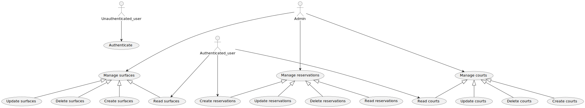

# Tennis Club

### Technology stack

| Field         | Technologies                                                                                                                                                                                                        |
|---------------|---------------------------------------------------------------------------------------------------------------------------------------------------------------------------------------------------------------------|
| Enviroment    |   |
| Backend       |              |
| Documentation |                                                                                                        |

### UML

#### Class diagram

#### Use case diagram

### Development
- Open API 3: http://localhost:5000/api-docs
- Swagger: http://localhost:5000/api-docs/swagger-ui/index.html